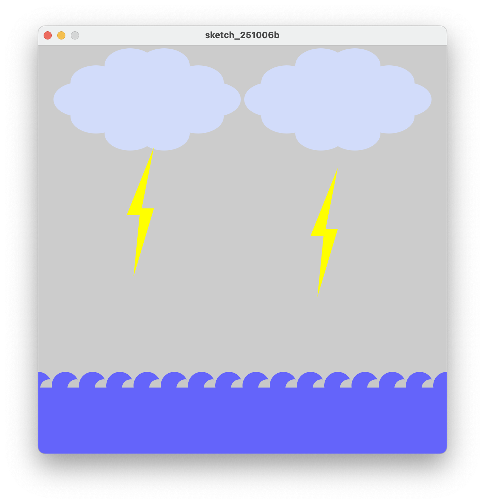

# Complex Drawing

While making this project, I enjoyed breaking complex shapes that I had drawn into simpler ones. Calculating how to position their components in order to maximize their resemblance to the sketch was interesting as well. In my case, the most challenging part was the creation of the waves. I had a few methods in mind, and in the end I chose to create them using circles.

## Initial sketch

## Annotated sketch

## Running code with classes

## Comments on using classes

I think using classes to make complex drawings is a good way to organize the code and open the possibility of expanding and further working on the project.
